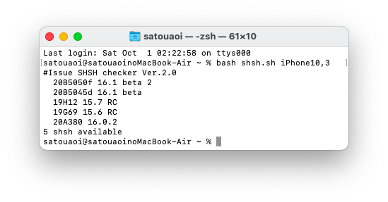
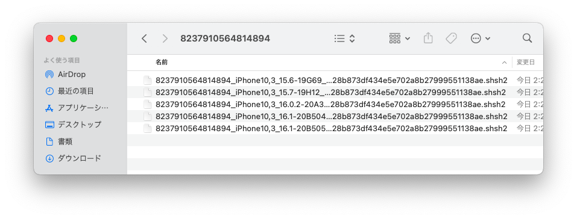

# Issue SHSH checker

復元可能なiOSバージョンをベータ版も含め簡単に確認 及び取得できるbashスクリプトです

# 対応OS

MacOSとintel_x86_64_Debian系で使用できます。

# 依存関係

ほとんどの依存関係は自動で解決できますがLinuxのみtsscheckerのインストールが必要です  
MacOSはHomebrewをインストールしてください  

# 実行の仕方

shsh.shを実行すると検索が開始されます  

例:) bash Issue_SHSH_checker.sh iPhone10,3  

引数にECIDを指定するとベータ版を含め発行中のSHSHを全て取得できます  

例:) bash Issue_SHSH_checker.sh iPhone10,3 8237910564814894  

# Credits

@tihmstar  
https://github.com/tihmstar/tsschecker
https://github.com/tihmstar/partialZipBrowser  

@m1stadev  
https://github.com/m1stadev/ios-beta-api

#取得元
https://github.com/m1stadev/ios-beta-api  
https://api.ipsw.me/

