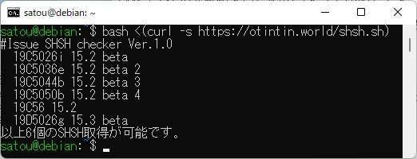

# Issue SHSH checker

復元可能なiOSバージョンをベータ版も含め簡単に確認できるbashスクリプトです

# 依存関係

JSONファイルを解析するためjqコマンドが必要です。

Debian系OSの場合下記コマンドで依存関係を解決できます。

sudo apt install jq

# 仕組み

shsh.hostからJSON情報を取得しiPhone9,4の発行状況を確認します。取得元の情報によっては最新ではない可能性があるため表示されたバージョンで復元できる保証はできません。

# 実行の仕方

shsh.shを実行すると検索が開始されます

例:) bash shsh.sh

以下コマンドを使用すればgitからcloneすることなく実行することも可能です

例:) bash <(curl -s https://raw.githubusercontent.com/Aoi-Developer/IssueSHSHchecker/main/shsh.sh)
